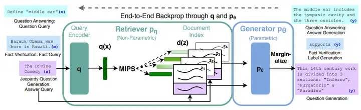
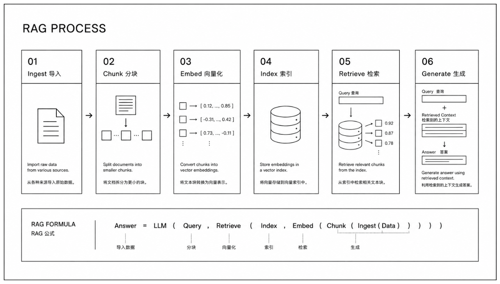
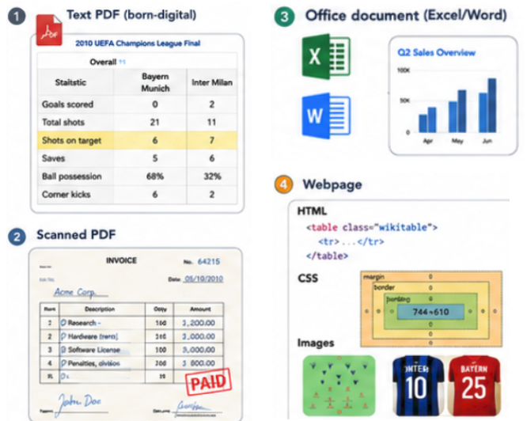

# 背景

llm的能力局限
每当将大模型应用于实际业务场景时发现，通用的基础大模型基本无法满足实际业务需求，主要有以下几方面原因：

知识截止:大模型自身的知识完全源于训练数据，而现有的主流大模型（deepseek、gpt、通义千问…）的训练集基本都是构建于网络公开的数据，对于一些实时性的、非公开的或私域的数据是没有。此外模型的训练数据有明确的时间边界，一旦问到边界之后的事情，比如"2025 年诺贝尔奖得主是谁"，它便无从知晓，而 RAG 可以通过实时检索外部知识库来补上这段空白。

幻觉问题:所有的深度学习模型的底层原理都是基于数学概率，模型输出实质上是一系列数值运算，大模型也不例外，所以它经常会一本正经地胡说八道，尤其是在大模型自身不具备某一方面的知识或不擅长的任务场景。面对不确定的内容，模型倾向于"一本正经地编造"看似合理的答案，虚构出并不存在的论文或数据，而 RAG 让回答建立在检索到的真实文档之上，并且可以溯源。

领域知识缺失:企业的私有数据、专业领域的知识往往不在训练集里，像"公司上季度的销售额是多少"这样的问题模型根本答不上来，而 RAG 恰好能把企业知识库、文档系统连接进来。对于企业来说，数据安全至关重要，没有企业愿意承担数据泄露的风险，尤其是大公司，没有人将私域数据上传第三方平台进行训练会推理。这也导致完全依赖通用大模型自身能力的应用方案不得不在数据安全和效果方面进行取舍。

上下文窗口有限:即便模型支持 128K 乃至 1M token，也塞不下一个百万级文档的知识库，RAG 则通过精准检索，只把最相关的片段注入上下文。

RAG：检索增强生成
RAG，全称Retrieval Augmented Generation（检索增强生成），其工作原理为：当用户提问时，系统先从海量知识库中检索出与问题相关的实时或私有信息，并将这些信息作为参考背景与问题一起提供给大模型，让模型像做开卷考试一样，基于提供的可靠证据生成更准确、实时且可溯源的回答。



https://arxiv.org/pdf/2005.11401 Facebook AI 2020 年提出 RAG 概念的开山之作，定义了「检索器 + 生成器」联合训练范式

# 关于RAG内核的设计

当前主要计划选型fastapi来实现rag core，针对rag的话大致讲一下目前的理解和关注点

## 三模块两阶段

三模块主要有检索器，生成器，外部知识库（或检索融合）：
- 检索器（Retriever），从外部知识库中召回与查询最相关的文档片段，包含查询编码器、索引结构（如向量数据库）和相似度匹配机制（如 ANN 近似最近邻搜索）
- 生成器（Generator），基于检索结果生成最终回答，通常是大语言模型（LLM），将"用户查询 + 检索到的上下文"作为提示输入，生成连贯答案
- 外部知识库（Knowledge Database），存储用于检索的原始数据，文档经过分块（Chunking）、向量化（Embedding）后构建的索引库，是 RAG 的知识来源

两阶段主要有检索（Retrieval）和生成（Generation）

- 检索（Retrieval）：用户查询 → 向量化 → 相似度匹配 → 召回相似文档（将查询 $q$ 编码为向量，与知识库中的文档片段进行相似度计算，选出最相关的 $K$ 个片段构成上下文 $\mathcal{X}_q$ ）
- 生成（Generation）：查询 + 检索上下文 → 构造 Prompt → LLM 生成答案（将原始查询与召回的上下文拼接，输入生成器，由模型产生基于外部知识的回答）

## RAG 流程



### 01-检索器



当前计划落地架构：

```md
    原始文件
    → 文档加载器: 读取字节流(文件系统、URL、S3、API、数据库)
    → 格式路由（PDF / Office / HTML / MD / Image / 扫描件 -> 确定文件类型来决定走哪一条解析路径）
    → 文档解析器（解析引擎）
        PDFLoader（Docling 默认 + MinerU 复杂页兜底）（处理的过程注意页眉页脚、页码、水印的清洗）
        OfficeLoader（DOCX/PPTX/XLSX → 统一中间表示）（注意项同上）
        HTML/MDLoader
        ImageLoader（OCR + VLM 描述）
    → 清洗（重复版权声明、乱码、敏感信息脱敏、重复段落/模板文本去除、编码等问题进行处理，实现去噪、脱敏、规范化）

    → 文档分割器（文档切块）
        输入：StructuredDocument
        策略：Layout-aware / Hierarchical / Semantic Hybrid
        按章节、表格、列表、公式边界切，而不是固定 token 
        输出：List[Chunk]（text + metadata + hierarchy path）

    → Embedding + 元数据入库（向量库）
```

原始文档 → [文档加载器: 读取字节流] → [格式路由: 识别格式并分发] → [文档解析器: 提取文本] → [切分/向量化]

ref：https://jishuzhan.net/article/2025749372122759169
https://xuqi2024.github.io/2026/08/07/2026-08-07-mineru-document-parsing-agent-rag-architecture-deep-dive/
https://rag.deeptoai.com/docs/rag-project-analysis/03-data-processing-indexing/02-%E5%88%86%E5%9D%97%E7%AD%96%E7%95%A5%E4%B8%8E%E7%AE%97%E6%B3%95#1-%E5%9B%BA%E5%AE%9A%E9%95%BF%E5%BA%A6%E5%88%86%E5%9D%97baseline


#### 01-文档加载器

文档加载器（Document Loader）只负责"从来源读取原始数据"，这里设计成一个纯粹的 I/O 层，RAG 管道的后续阶段才能保持干净和可扩展。
```
┌─────────────────────────────────────────────────────────────┐
│  Source Adapter Layer    ← 对接各种来源（本地/S3/URL/DB/API │
├─────────────────────────────────────────────────────────────┤
│  Stream Handler Layer    ← 流式读取、大文件分片、断点续传   │
├─────────────────────────────────────────────────────────────┤
│  Metadata Extractor      ← 提取文件名、路径、时间戳、MIME类 │
├─────────────────────────────────────────────────────────────┤
│  Output Normalizer       ← 统一输出格式（RawDocument 对象   │
├─────────────────────────────────────────────────────────────┤
│  Progress & Monitor      ← 进度追踪、监控、日志、失败隔离   │
└─────────────────────────────────────────────────────────────┘
```
相关设计文档见

#### 02-格式路由

面对多模态的文档输入（PDF / Office / HTML / MD / Image / 扫描件），单一解析引擎无法满足需求。因此业务上需要设计一个智能路由系统，具备以下能力：

- 引擎选择智能化：根据文件类型自动选择最佳引擎
- 自动回退机制：引擎失败时尝试备用方案，记录回退原因用于后续优化
- 质量评估体系：实时计算解析质量分数，识别乱码、空白、格式错误，为下游系统提供质量参考
- 可观测性：记录每次解析的引擎、耗时、质量，支持A/B测试对比不同引擎效果，为引擎优化提供数据支持

相关设计文档见

#### 03-文档解析器

文档解析器主要处理的问题有文档格式支持（PDF，Office，HTML/MD，图像，图表/公式）、结构保持、错误恢复等
业务上需要设计一个多阶段、多模态并发的智能处理管线，设计目标还应该包括实现布局感知解析和深度文档理解的能力

解析质量的三个维度主要有：
- 准确性：文字、表格、公式是否正确提取
- 完整性：是否保留了所有重要信息（标题、列表、引用）
- 结构化：是否保留了文档的层次结构（章节、段落）

相关的设计文档见

#### 04-文档清洗器

文档解析后还需要进行去除乱码/特殊字符，空白规范化，重复段落/模板文本去除，**敏感信息脱敏**，编码统一，非目标语言检测与过滤等处理
解析器应输出带结构标记的中间格式，方便清洗层识别，清洗层可以基于这些标记做决策

#### 05-文档分割器

ref: https://apxml.com/zh/courses/getting-started-rag/chapter-3-data-preparation-for-rag/need-for-chunking
https://rag.deeptoai.com/docs/rag-project-analysis/03-data-processing-indexing/02-%E5%88%86%E5%9D%97%E7%AD%96%E7%95%A5%E4%B8%8E%E7%AE%97%E6%B3%95#1-%E5%9B%BA%E5%AE%9A%E9%95%BF%E5%BA%A6%E5%88%86%E5%9D%97baseline

这里要调研一下多个分块策略，可能先看向量数据库的选型


    2.不同业务类型的文档切分方式可以选型
    3.可以根据自己的业务构造数据微调embeding。
    3.1 可以加 hyde
    3.2 query改写的方式
    3.3 动态topk
    3.4父子 chunk
    4. embading选型我理解是：业务深度和时延选一下