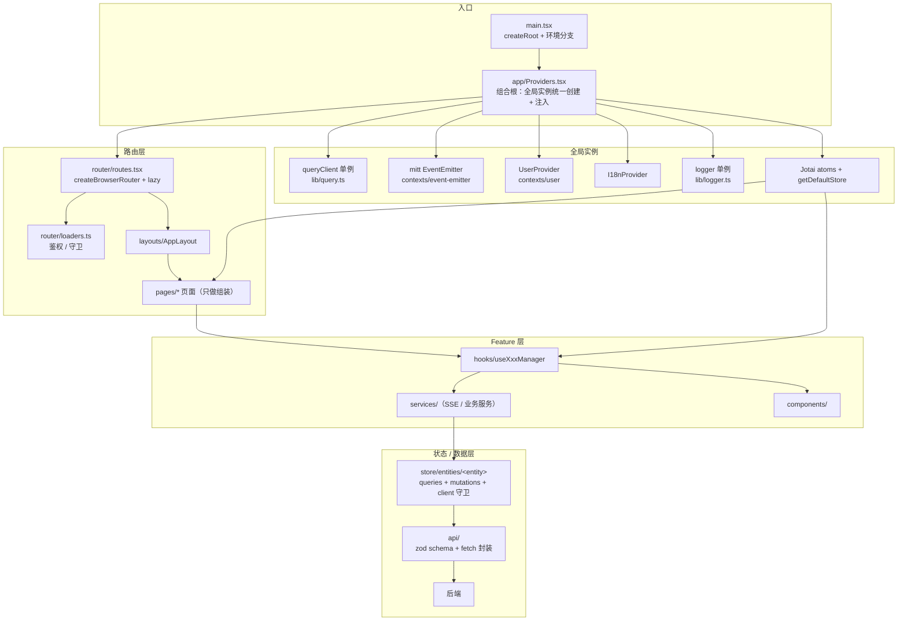

### 1.1 组合根 + 模块级单例 + Context 注入（无 DI 容器）

- `src/app-shell.tsx` 是唯一接线点：`queryClient` 等在模块顶层 `new` 一次（`src/lib/query.ts`），再通过 Provider 注入。
- mitt 事件总线用 `useRef` 创建（`src/contexts/event-emitter-context/provider.tsx`）。
- `OtpAuthStore` 用 `useMemo(() => createOtpAuthStore(), [])` 创建，且支持外部注入（`src/features/otp-auth/providers/OtpAuthProvider.tsx`）。

**价值**：不需要 inversify 之类的 DI 容器；测试用「外部实例覆盖」即可隔离；全局实例的创建点全局唯一、可审查。

### 1.2 双通道状态访问

- UI 态：Context + 自定义 hook（`useGlobalEventEmitter` 在 Provider 外直接 throw，防止误用）。
- 非 React 代码：Jotai atom + `getDefaultStore()`（`src/lib/global-config.ts` 的 `getTccConfig`）。

**价值**：工具函数、SDK 回调、SSE 处理器里不需要 React 也能读写全局态。

### 1.3 Entity Store 分层（React Query 封装）

`src/store/entities/message/` 拆成：

- `queries/options.ts` — queryKey + queryFn 唯一真源
- `queries/hooks.ts` — 页面消费 hooks
- `mutations/` — 写操作
- `selectors.ts` — 派生选择器
- `client.ts` — 本地缓存写入（可加守卫）

**价值**：key 不散落、selector 可复用、写入逻辑集中在 client 可加审计/守卫。

### 1.4 流式写入守卫（状态变更可审计）

`immutableUpdateMessageListLocalData` 强制带 `source` 字段，流式期只放行 `stream-base` / `revalidate`，其余 source 拒写并上报（`src/store/entities/message/client.ts`）。

**价值**：把「哪些写入合法」变成代码强制，而不是 code review 口头约定。

### 1.5 Feature-first 目录 + 横向分层

`src/features/stream/` 内部再分 `hooks / services / constants / types / utils`，页面只做组装。

**价值**：功能内聚，删除一个 feature 就是删一个目录。

### 1.6 多平台类型边界

`src/`、`electron-app/`、`chrome-extension/` 之间禁止直接 import 类型，公共契约放根目录 `shared/types`，通过 `@contracts/*` 单向引用。

**价值**：多端项目防止「类型漂移」和反向依赖。

### 1.7 治理自动化

- ESLint `no-restricted-imports` / `no-restricted-syntax` 拦截打包体积、滚动 smooth 等。
- 独立 check 脚本（`check:color-tokens`）+ Husky + commitlint + commit-msg 强制 `Reviewed-by` trailer。

**价值**：把易犯错误变成机器拦截，AGENTS.md 只兜底人工判断。

### 1.8 其它值得抄的小点

- 宿主注入对象（`window.AICOE_CONFIG`）只读快照语义，不当作可写 store。
- `localStorage` 统一封装（`src/lib/storage.ts`），不直接碰原生 API。
- 惰性路由 + 入口域名分支（`src/root.tsx`），首屏可裁剪。
- 单向依赖：页面 → 编排 hook（`useChatManager`）→ stream 服务 → store → api。

### 1.9 新项目可以改进的局限

- API 层基本手写类型，zod 只在极个别 feature 使用——新项目建议在 API 边界统一用 zod 校验。
- 全局 `queryClient` 单例在测试间共享，隔离靠外部 store 注入约定，没有硬约束——脚手架里通过 Providers 的外部实例 prop 补强。

---

## 2. 脚手架技术选型

| 领域 | 选型 | 理由 |
| --- | --- | --- |
| 语言/构建 | TypeScript 5.7（strict）+ Vite 6 | 生态成熟 |
| UI | React 18 + Tailwind CSS 4 + Radix 原语 | 主题 token 化，设计系统可扩展 |
| 路由 | React Router 7（createBrowserRouter + lazy） | loader 可做鉴权/守卫 |
| 服务端状态 | TanStack Query 5 | entity store 模式的地基 |
| 客户端全局态 | Jotai | atom + getDefaultStore 双通道 |
| 校验 | Zod 4 | 在 API 边界做运行时契约 |
| 事件总线 | mitt | 轻量、类型化 |
| 测试 | Vitest + Testing Library + MSW | 组件测试 + mock API |
| 工程 | pnpm workspace + Husky + lint-staged + commitlint | 多端共享契约、提交治理 |
| 环境 | 多 mode 构建（`.env.cn` / `.env.va` …） | 多 region 部署 |

---

## 3. 分层架构设计

```text
入口(main.tsx, 最薄)
  → 组合根(App/Providers, 统一创建注入全局实例)
    → Router(createBrowserRouter, lazy + loaders)
      → Layout → 页面(Page, 只做组装)
        → 编排 hook(feature 的 useXxxManager)
          → services(SSE/API/业务服务)
            → entity store(queries/mutations/selectors/client)
              → api 层(zod schema + fetch 封装)
                → 后端
```

### 架构原则

- **单向依赖**：页面 → feature → store → api，禁止反向。
- **全局实例只有一个创建点**（组合根），其它代码只消费。
- **每条数据写入有 source/owner**，可审计、可拦截。
- **多端共享契约放 `shared/contracts`**，各端单向引用。

### 架构图（Mermaid）



---

## 4. 脚手架文件树

```text
my-app/
├── apps/
│   └── web/                       # 主应用（未来可加 electron-app / extension）
│       ├── index.html
│       ├── vite.config.ts
│       └── src/
│           ├── main.tsx           # 入口：createRoot，只做域名/环境分支
│           ├── app/               # 组合根
│           │   ├── App.tsx        # withErrorBoundary 包装
│           │   ├── Providers.tsx  # 所有 Provider 树（全局实例统一创建点）
│           │   └── AppBootstrap.tsx # 一次性副作用（initJsBridge/initTea/…）
│           ├── router/
│           │   ├── routes.tsx     # createBrowserRouter + lazy
│           │   ├── loaders.ts     # auth/vpn/upgrade 守卫
│           │   └── layouts/AppLayout.tsx
│           ├── pages/             # 页面级组件，只做组装
│           │   ├── home/HomePage.tsx
│           │   └── chat/ChatPage.tsx
│           ├── features/          # feature-first，自包含
│           │   └── chat/
│           │       ├── index.ts
│           │       ├── components/    # PromptInput / MessageList / …
│           │       ├── hooks/         # useChatManager / useSendMessage
│           │       ├── services/      # SSE / API 服务
│           │       ├── constants.ts
│           │       └── types.ts
│           ├── store/
│           │   ├── atoms/             # Jotai 全局原子
│           │   └── entities/          # Entity Store 模式
│           │       └── <entity>/
│           │           ├── index.ts
│           │           ├── client.ts      # 本地缓存写入 + 守卫
│           │           ├── selectors.ts
│           │           ├── types.ts
│           │           ├── queries/{options.ts, hooks.ts}
│           │           └── mutations/{options.ts, hooks.ts}
│           ├── api/
│           │   ├── client.ts        # fetch 封装（token/错误码/超时）
│           │   ├── schemas.ts       # zod schema（API 契约）
│           │   └── <domain>.ts      # 每个域一组函数
│           ├── lib/                 # 基础设施单例
│           │   ├── query.ts         # export const queryClient
│           │   ├── storage.ts       # localStorage 统一封装
│           │   ├── emitter.ts       # mitt 类型
│           │   ├── logger.ts        # slardar/sentry 封装
│           │   └── env.ts
│           ├── contexts/            # 只有需要跨 feature 的 Context
│           │   ├── user/
│           │   └── event-emitter/
│           ├── design/              # 设计系统 token/组件
│           │   ├── tokens.css
│           │   └── ui/              # Button/Input/…
│           ├── hooks/               # 全局通用 hooks
│           ├── test/                # 测试工具（providers wrapper）
│           │   └── renderWithProviders.tsx
│           └── types/               # 全局共享类型（业务内）
├── shared/
│   └── contracts/                   # 多端共享契约（zod schema + 类型）
│       ├── chat.ts
│       └── index.ts
├── scripts/                         # 治理脚本
│   ├── check-contracts.mjs
│   └── check-commit-trailer.mjs
├── docs/                            # ADR / 架构图 / 治理文档
├── AGENTS.md                        # 项目规约（给 agent 也给人）
├── .oxlintrc.json                   # oxlint 配置（替代 ESLint）
├── .prettierrc
├── .husky/
│   ├── pre-commit                 # lint-staged
│   └── commit-msg                 # commitlint + trailer 校验
└── package.json                   # pnpm workspace
```

---

## 5. 关键骨架代码

### 5.1 入口（最薄）— `src/main.tsx`

```tsx
import { createRoot } from 'react-dom/client';
import './design/tokens.css';
import { App } from './app/App';

const container = document.getElementById('root')!;
createRoot(container).render(<App />);
```

### 5.2 组合根（唯一创建点）— `src/app/Providers.tsx`

```tsx
import { QueryClientProvider } from '@tanstack/react-query';
import { ConfigProvider } from '@/design';
import { queryClient } from '@/lib/query';
import { UserProvider } from '@/contexts/user';
import { GlobalEventEmitterProvider } from '@/contexts/event-emitter';
import { I18nProvider } from '@/features/i18n';

export const Providers = ({ children }: { children: React.ReactNode }) => (
  <ConfigProvider>
    <QueryClientProvider client={queryClient}>
      <I18nProvider>
        <GlobalEventEmitterProvider>
          <UserProvider>{children}</UserProvider>
        </GlobalEventEmitterProvider>
      </I18nProvider>
    </QueryClientProvider>
  </ConfigProvider>
);
```

> 约定：全局实例的创建只允许出现在这里（模块单例 import 或 Provider 内 `useRef/useMemo`），写进 AGENTS.md。

### 5.3 单例 — `src/lib/query.ts`

```ts
import { QueryClient } from '@tanstack/react-query';

export const queryClient = new QueryClient({
  defaultOptions: { queries: { gcTime: 2 * 60 * 1000 } },
});
```

### 5.4 Entity Store 模板 — `store/entities/<entity>/queries/options.ts`

```ts
import { queryOptions } from '@tanstack/react-query';
import { getXxx } from '@/api/xxx';

export const getEntityQueryKey = (id: string) => ['entities', id];

export const getEntityQueryOptions = ({ id }: { id: string }) =>
  queryOptions({
    queryKey: getEntityQueryKey(id),
    queryFn: () => getXxx({ id }),
  });
```

### 5.5 写入守卫 — `store/entities/<entity>/client.ts`

```ts
export type WriteSource = 'stream' | 'mutation' | 'revalidate';
const BLOCKED_DURING_STREAM = new Set(['mutation']);

export const updateLocalData = ({ source }: { source: WriteSource }) => {
  if (BLOCKED_DURING_STREAM.has(source) && isStreaming()) {
    logger.warn('write_blocked_during_stream', { source });
    return;
  }
  // ...不可变写入（mutative / produce）
};
```

### 5.6 API 边界（zod 契约）— `src/api/chat.ts`

```ts
import { z } from 'zod';
import { apiFetch } from './client';

export const ChatMessageSchema = z.object({ id: z.string(), content: z.string() });

export const getMessages = async (sessionId: string) => {
  const raw = await apiFetch(`/chat/${sessionId}/messages`);
  return z.array(ChatMessageSchema).parse(raw); // 运行时契约
};
```

### 5.7 测试注入 — 组合根支持外部实例

```tsx
type ProvidersProps = { queryClient?: QueryClient; children: React.ReactNode };

export const Providers = ({ queryClient: injected, children }: ProvidersProps) => (
  <QueryClientProvider client={injected ?? queryClient}>{children}</QueryClientProvider>
);
```

测试里 `renderWithProviders` 传独立 client（照抄 `OtpAuthProvider` 的 `store` prop 思路）。

---

## 6. 落地步骤

1. `pnpm create vite web --template react-ts`，`pnpm add` React Query / Jotai / Router / Zod / mitt，dev 依赖加 Vitest、Testing Library、MSW、ESLint 9 全家桶。
2. 按文件树建目录，先写 `lib/query.ts` + `app/Providers.tsx` + `router/routes.tsx`（三个空 feature 验证链路）。
3. 写第一个 feature 走完整链路：`pages/xxx` → `features/xxx/{hooks,services}` → `store/entities/xxx` → `api/xxx`，跑通一个查询 + 一个 mutation。
4. 接治理：Husky + lint-staged + commitlint + `scripts/check-contracts.mjs`，把「禁止反向 import、全局实例只能创建于组合根」写进 `AGENTS.md` 和 ESLint `no-restricted-imports`。
5. 多端需求出现时再加 `shared/contracts`（zod 是天然的多端契约载体）和第二个 app。
