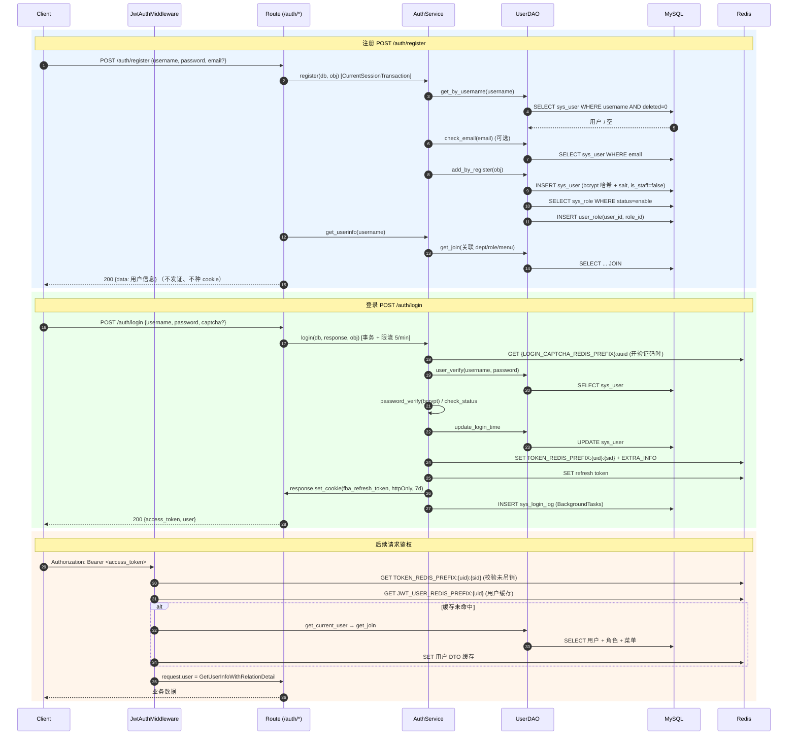

# 注册与登录时序图

后端认证采用「MySQL 存身份 + Redis 存会话态」的双存储设计：注册只在 `sys_user` / `user_role` 落库、不发 token；登录把 refresh token 种进 httpOnly cookie、access token 放响应体，并把会话态写进 Redis；后续请求由中间件用 Bearer + Redis 缓存完成鉴权。

## 涉及的数据存储

- **MySQL**：`sys_user`（身份/密码/状态）、`sys_role`、`user_role`（关联）、`sys_login_log`（登录日志）
- **Redis**：`TOKEN_REDIS_PREFIX`（token 吊销）、`TOKEN_EXTRA_INFO_REDIS_PREFIX`（token 附加信息）、`JWT_USER_REDIS_PREFIX`（用户 DTO 缓存）、`LOGIN_CAPTCHA_REDIS_PREFIX`（验证码）、登录失败计数
